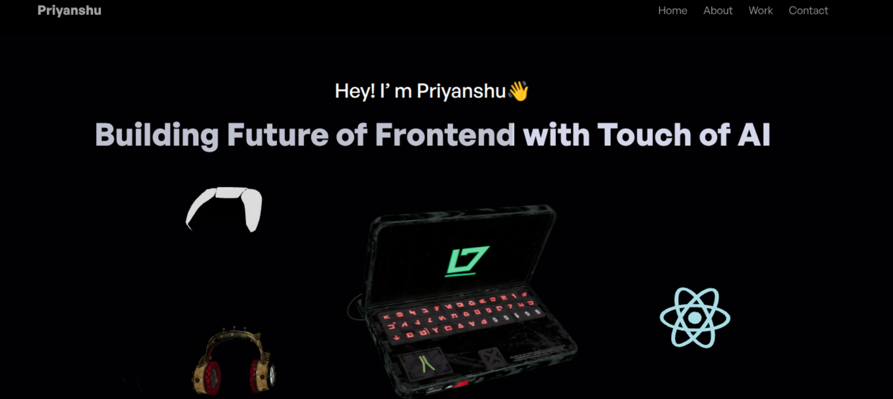
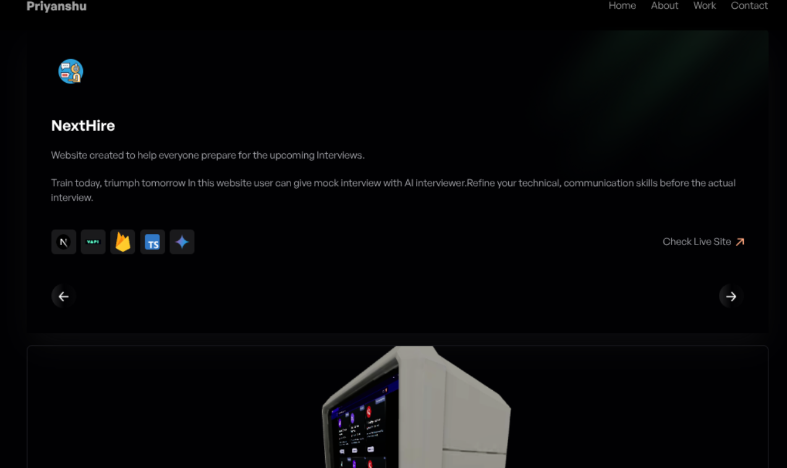

# Priyanshu's Portfolio

A modern, interactive portfolio built with **React**, **Three.js**, and **Vite**. Showcasing frontend skills, AI enthusiasm, and project highlights.



## Features

- Responsive 3D hero section
- Project carousel with live previews
- Testimonials from clients
- Contact form with EmailJS integration
- Downloadable resume
- Social media links



## Tech Stack

- React 18
- Vite
- TailwindCSS
- Three.js & @react-three/fiber
- EmailJS
- Leva (for controls)
- React Responsive

## Getting Started

1. **Install dependencies:**
   ```sh
   npm install
   ```

2. **Run locally:**
   ```sh
   npm run dev
   ```

3. **Build for production:**
   ```sh
   npm run build
   ```

## Folder Structure

- `src/` – React components, sections, and styles
- `public/assets/` – Images and 3D assets
- `src/Userdata/` – Data for navigation, projects, and reviews

## Customization

- Update your details in [`src/Userdata/navlinks.js`](src/Userdata/navlinks.js)
- Replace images in [`public/assets/`](public/assets/)
- Modify styles in [`src/index.css`](src/index.css) and [`tailwind.config.js`](tailwind.config.js)

## License

This project uses open-source 3D models. See [`public/laptop/license.txt`](public/laptop/license.txt) for credits.

---

Made with ❤️ by Priyanshu Paul
